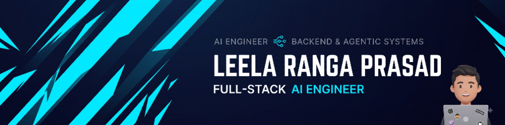

<!-- HERO BANNER -->

<!-- TYPING ANIMATION -->

  
  
  
  
  

---

### ⚡ Executive Profile & Engineering Philosophy

I am an **AI Engineer & Data Science Undergraduate (B.Tech 2024–2028, CGPA 8.83/10)** at **VR Siddhartha Engineering College**, specializing in **Autonomous Agentic Systems**, **Cybersecurity Forensics**, and **Scalable Backend Architectures**. 

As a **Smart India Hackathon Team Lead** (SIH 2026 & SIH 25029) and former **Google Student Representative (Gemini AI)**, I engineer mission-critical systems that bridge cutting-edge deep learning research with high-throughput distributed infrastructure. My work powers automated digital forensic investigations for CERT-In / cyber cells, deterministic edge IoT for agricultural supply chains, and event-driven multi-agent commerce workflows.

* 🔭 **Currently Building**: Large-scale digital forensics pipelines and autonomous agent swarms with LLaMA 3, LangGraph, and FastAPI.
* 🛠️ **Engineering Tenets**: Deterministic math over stochastic guesswork • Clean Architecture & Unidirectional Data Flow (UDF) • Sub-second API latencies • Automated CI/CD & zero-drop webhook processing.
* 🎯 **Seeking**: Summer 2026 AI Engineer, Machine Learning Systems, and Backend SWE Internships / Roles across FAANG, Tier-1 Tech, and frontier AI research labs.

---

### 🚀 Featured Engineering Flagships

<table>
  <tr>
    <td width="50%" valign="top">
      <h3 align="left">🛡️ <a href="https://github.com/nleelaranga-ai/TraceMail-AI">TraceMail-AI</a></h3>
      
<b>Automated Cyber Forensic Investigation & Threat Attribution Platform</b>

      
Flagship system engineered for <b>Smart India Hackathon 2026 (SIH26106)</b> targeting CERT-In, state cyber police, and enterprise SOC analysts. Ingests raw RFC 822 / MIME emails, performs cryptographic SPF/DKIM/DMARC validation, enriches hops with VirusTotal v3 & AbuseIPDB v2, scores phishing with fine-tuned transformers, and generates court-admissible SHA-256 PDF forensic dossiers.

      

        
        
        
        
        
      

      
🔗 <a href="https://github.com/nleelaranga-ai/TraceMail-AI"><b>View Architecture & Source Code →</b></a>

    </td>
    <td width="50%" valign="top">
      <h3 align="left">🌾 <a href="https://github.com/nleelaranga-ai/GrainGuardian-AI">GrainGuardian-AI</a></h3>
      
<b>Hardware-to-Mobile Paddy Storage Health & Aflatoxin Prevention System</b>

      
Dual-mode agronomic intelligence engine pairing a physical 3-depth sensor probe (SEN0193 capacitive moisture + 3x DS18B20 + DHT22) via <b>BLE GATT (1 Hz stream)</b> with a native Android client. Implements a 5-packet rolling stabilization gate and a zero-cloud deterministic mathematical engine calculating Thermal Gradient Index ($\text{TGI}$) and Biological Degradation Risk Score ($\text{BDRS}$).

      

        
        
        
        
        
      

      
🔗 <a href="https://github.com/nleelaranga-ai/GrainGuardian-AI"><b>View Architecture & Hardware Spec →</b></a>

    </td>
  </tr>
  <tr>
    <td width="50%" valign="top">
      <h3 align="left">🤖 <a href="https://github.com/nleelaranga-ai/RAFON-AI-Commerce-Agent">RAFON-AI-Commerce-Agent</a></h3>
      
<b>Autonomous Multi-Agent Commerce Intelligence & Negotiation Swarm</b>

      
Production-grade autonomous commerce agent leveraging ReAct planning and function-calling tool chains. Coordinates inventory forecasting, automated vendor price arbitrage, dynamic markdown strategies, and customer intent-to-checkout flows with ACID transaction guarantees and audit logs.

      

        
        
        
        
        
      

      
🔗 <a href="https://github.com/nleelaranga-ai/RAFON-AI-Commerce-Agent"><b>Explore Agent Workflow →</b></a>

    </td>
    <td width="50%" valign="top">
      <h3 align="left">🎓 <a href="https://github.com/nleelaranga-ai/SmartAI-Scholarship-Assistant">SmartAI-Scholarship-Assistant</a></h3>
      
<b>Multimodal RAG & Decentralized Academic Authenticity Engine</b>

      
Engineered for <b>Smart India Hackathon (SIH 25029)</b>. Combines computer vision OCR document parsing with SHA-256 cryptographic verification and a dense hybrid vector retrieval engine (RAG) to instantly match students to 1,200+ government and private scholarship opportunities with zero credential fraud.

      

        
        
        
        
      

      
🔗 <a href="https://github.com/nleelaranga-ai/SmartAI-Scholarship-Assistant"><b>Explore Verification Engine →</b></a>

    </td>
  </tr>
  <tr>
    <td width="50%" valign="top">
      <h3 align="left">🧭 <a href="https://github.com/nleelaranga-ai/CareerPilot-AI">CareerPilot-AI</a></h3>
      
<b>AI-Powered Career Trajectory & Resume Intelligence Copilot</b>

      
Autonomous career copilot analyzing engineering resumes against live industry skill graphs. Features ATS semantic scoring, gap-fill curriculum generation, mock technical interview evaluations, and personalized FAANG application tracking.

      

        
        
        
        
      

      
🔗 <a href="https://github.com/nleelaranga-ai/CareerPilot-AI"><b>View Career Copilot →</b></a>

    </td>
    <td width="50%" valign="top">
      <h3 align="left">🅿️ <a href="https://github.com/nleelaranga-ai/ParkShare">ParkShare</a></h3>
      
<b>Decentralized Peer-to-Peer Urban Parking Allocation Platform</b>

      
Real-time distributed booking platform pairing space owners with urban commuters. Employs geospatial indexing (H3 / PostGIS), dynamic surge pricing algorithms, automated slot reservation locks, and instant QR verification.

      

        
        
        
        
      

      
🔗 <a href="https://github.com/nleelaranga-ai/ParkShare"><b>View Architecture & Booking Engine →</b></a>

    </td>
  </tr>
  <tr>
    <td width="50%" valign="top">
      <h3 align="left">🤖 <a href="https://github.com/nleelaranga-ai/AI_Buddy_WA">AI_Buddy_WA</a></h3>
      
<b>Multimodal Autonomous WhatsApp Assistant & Microservice Swarm</b>

      
Production conversational assistant leveraging <b>WhatsApp Business Cloud API (Graph v24.0)</b> and <b>Groq Cloud</b> (LLaMA-3.3-70B, LLaMA-3.1-8B, and Whisper-Large-v3). Bridges voice note transcription, Google Workspace automation (Calendar FreeBusy scheduling, Drive, Sheets expense ledger), multi-format OCR document conversion, and real-time Indian Railways PNR transit tracking.

      

        
        
        
        
        
      

      
🔗 <a href="https://github.com/nleelaranga-ai/AI_Buddy_WA"><b>View Architecture & Assistant Swarm →</b></a>

    </td>
    <td width="50%" valign="top">
    </td>
  </tr>
</table>

---

### 🛠️ Technical Competencies & Toolchain

<table>
  <tr>
    <th width="25%">Domain</th>
    <th width="75%">Technologies, Frameworks & Libraries</th>
  </tr>
  <tr>
    <td><b>Languages</b></td>
    <td>
      
      
      
      
      
      
      
    </td>
  </tr>
  <tr>
    <td><b>AI, ML & NLP</b></td>
    <td>
      
      
      
      
      
      
      
      
    </td>
  </tr>
  <tr>
    <td><b>Backend & Cloud</b></td>
    <td>
      
      
      
      
      
      
      
      
    </td>
  </tr>
  <tr>
    <td><b>Databases & Caching</b></td>
    <td>
      
      
      
      
      
    </td>
  </tr>
  <tr>
    <td><b>Cybersecurity & Forensics</b></td>
    <td>
      
      
      
      
      
    </td>
  </tr>
</table>

---

### 🏆 Hackathon Leadership & Honors

* 🥇 **Team Lead — Smart India Hackathon 2026 (SIH26106)**: Architected *TraceMail-AI*, the premier cyber forensics platform selected for automated phishing investigation and IOC attribution.
* 🥇 **Team Lead — Smart India Hackathon (SIH 25029)**: Spearheaded development of *Authenticity Validator*, combining computer vision OCR and distributed ledgers for academic credential verification.
* 🎖️ **Top 35 Finalist — TechSprint Hackathon**: Competed against 500+ teams nationwide with high-impact software solutions.
* ⚡ **Google Student Representative (Gemini AI)**: Selected by Google to spearhead on-campus developer cohorts, leading technical workshops on prompt engineering, Gemini API microservices, and Vertex AI.
* 🚀 **Participant**: IBM National Hackathon & Razorpay AI Buildathon (engineered high-throughput payment & financial agent prototypes).
* ⚛️ **Quantum Fundamentals Program**: Completed advanced training in quantum computing fundamentals and quantum information theory.

---

### 📜 Industry Certifications & Credentials

* **Google Cloud Generative AI**: Gemini Model Architecture, Prompt Engineering & Vertex AI Deployment
* **AWS Cloud Foundations**: Cloud Architecture, Microservices, IAM & Distributed Resilience
* **Snowflake Data Engineering Professional**: Data Warehousing, Snowpark & Scalable Analytics
* **MongoDB Vector Search & RAG Applications**: High-Dimensional Embeddings, Semantic Search & Hybrid Retrieval
* **DeepLearning.AI — AI For Everyone**: Neural Network Principles, Deep Learning Systems & Ethics
* **Duke University — Java Programming & Software Engineering Fundamentals**: OOP Design, Algorithms & Data Structures

---

### 📊 GitHub Activity & Real-Time Telemetry

  <table border="0">
    <tr>
      <td>
        
      </td>
      <td>
        
      </td>
    </tr>
    <tr>
      <td colspan="2" align="center">
        
      </td>
    </tr>
  </table>

---

### 📬 Get In Touch

I am actively engaging with engineering leaders, technical recruiters, and researchers regarding **Summer 2026 AI / Backend Engineering roles**. Let's connect!

  
  &nbsp;
  
  &nbsp;
  
  &nbsp;
  

 

  Designed with precision &amp; modern engineering aesthetic. &copy; 2026 Leela Ranga Prasad. Built for FAANG &amp; High-Impact AI Engineering.

